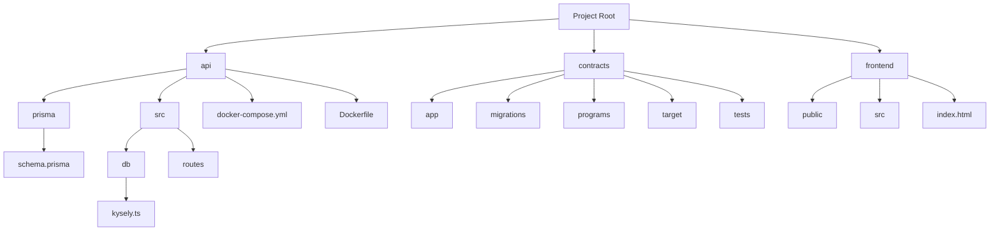

# DexYield

DexYield is a decentralized finance (DeFi) platform designed to optimize yield farming strategies in the Web3 ecosystem. By leveraging smart contracts and blockchain technology, DexYield provides users with secure, transparent, and efficient tools to maximize their returns.

## Structure



## Features

- **Automated Yield Optimization**: Automatically find and execute the best yield farming opportunities.
- **Multi-Chain Support**: Operates across multiple blockchain networks for maximum flexibility.
- **Secure Smart Contracts**: Audited contracts to ensure the safety of user funds.
- **Real-Time Analytics**: Track your portfolio performance with detailed insights.
- **Community Governance**: Participate in decision-making through a decentralized governance model.

## Getting Started

1. Clone the repository:

   ```bash
   git clone https://github.com/MTthoas/dexyield.git
   cd dexyield
   ```
