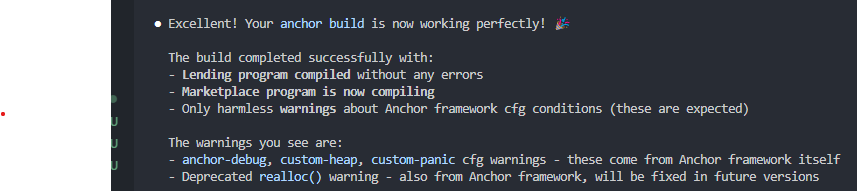

# 🚀 DexYield - Decentralized Yield Farming Protocol



## 💡 Qu'est-ce que DexYield ?

**DexYield** est un protocole de yield farming décentralisé construit sur Solana qui permet aux utilisateurs de déposer des tokens USDC et de gagner des rendements automatiquement à travers des stratégies optimisées.

### 🎯 Vision
Démocratiser l'accès aux rendements DeFi en offrant une solution simple, sécurisée et transparente pour faire fructifier vos cryptomonnaies.

---

## ✨ Fonctionnalités Principales

### 🏦 **Dépôts Simplifiés**
- Déposez vos USDC en un clic
- Recevez des Yield Tokens (YT) représentant votre position
- Minimum de dépôt : 1 USDC
- Frais de transaction ultra-bas grâce à Solana

### 💰 **Rendements Automatiques**
- **5% APY** sur la stratégie USDC de base
- Calcul des rendements en temps réel
- Accumulation automatique des gains
- Pas de période de verrouillage

### 🔄 **Tokens Yield (YT)**
- Tokens représentant vos positions de rendement
- Échangeables sur le marketplace intégré
- Ratio 1:1 avec vos dépôts USDC
- Liquidité garantie

### 🛡️ **Sécurité Renforcée**
- Architecture basée sur les **Program Derived Addresses (PDA)**
- Contrôles d'autorité séparés
- Validation des stratégies
- Audit complet des smart contracts

---

## 🔧 Architecture Technique

### 📋 **Programmes Smart Contracts**

#### 🏛️ **Programme de Lending**
- **Address**: `GBhdq8ypCAdTEqPLm4ZQA4mSUjHik7U43FMoou3qwLxo`
- **Fonctions**: Gestion des dépôts, calcul des rendements, stratégies
- **Sécurité**: PDA-based account management

#### 🏪 **Programme Marketplace**
- **Address**: `Gju2aAZ2WnbEnEgGZK5fzxj2fevfwexYL5d411ZyY7tv`
- **Fonctions**: Échange de YT tokens, liquidité, trading

### 🏗️ **Composants Clés**

```
┌─────────────────┐    ┌─────────────────┐    ┌─────────────────┐
│   Pool PDA      │    │   Strategy PDA  │    │  User Deposit   │
│   (Lending)     │───▶│   (USDC 5%)     │───▶│   PDA (User)    │
└─────────────────┘    └─────────────────┘    └─────────────────┘
         │                       │                       │
         ▼                       ▼                       ▼
┌─────────────────┐    ┌─────────────────┐    ┌─────────────────┐
│  YT Mint PDA    │    │ Pool Authority  │    │  Token Accounts │
│  (Yield Token)  │    │    PDA          │    │     (ATA)       │
└─────────────────┘    └─────────────────┘    └─────────────────┘
```

---

## 🚦 Comment Commencer

### 1️⃣ **Prérequis**
- Wallet Solana configuré
- USDC sur le devnet Solana
- Connexion Internet

### 2️⃣ **Installation & Setup**
```bash
# Cloner le projet
git clone https://github.com/your-repo/DexYield
cd DexYield/contracts

# Installer les dépendances
npm install

# Configurer Solana pour devnet
solana config set --url devnet

# Initialiser le protocole
npx ts-node scripts/setup-working.js
```

### 3️⃣ **Première Utilisation**
```bash
# Tester un dépôt
npx ts-node scripts/test-deposit.js

# Vérifier les PDAs
npx ts-node scripts/test-pda.js
```

---

## 📊 Économie du Protocole

### 💎 **Tokens**
- **Base Token**: USDC (Devnet: `4zMMC9srt5Ri5X14GAgXhaHii3GnPAEERYPJgZJDncDU`)
- **Yield Token (YT)**: Tokens représentant les positions de rendement
- **Ratio**: 1 USDC = 1 YT lors du dépôt

### 📈 **Stratégies de Rendement**
| Stratégie | APY | Risque | Liquidité |
|-----------|-----|--------|-----------|
| USDC Base | 5%  | Faible | Immédiate |
| *Futures* | TBD | Moyen  | Variable  |

### 💸 **Frais**
- **Dépôt**: Gratuit
- **Retrait**: Gratuit
- **Échange YT**: Frais de transaction Solana uniquement

---

## 🛠️ Guide Technique

### 🔍 **Scripts Disponibles**

#### `setup-working.js`
Script d'initialisation complet du protocole :
- Configure l'environnement Solana
- Déploie les PDAs nécessaires
- Initialise les pools et stratégies
- Crée les comptes utilisateur

#### `test-deposit.js`
Script de test pour les dépôts :
- Vérifie les balances USDC
- Effectue un dépôt de test (10 USDC)
- Mint les Yield Tokens correspondants
- Affiche les résultats

#### `test-pda.js`
Utilitaire de calcul des PDAs :
- Calcule les adresses des strategies
- Vérifie la cohérence des comptes
- Outil de debugging

### 🏗️ **Déploiement**
```bash
# Build des programmes
anchor build

# Déploiement sur devnet
anchor deploy --provider.cluster devnet

# Tests
anchor test
```

---

## 🎯 Roadmap

### 📅 **Phase 1 - MVP** ✅
- [x] Smart contracts de base
- [x] Interface de dépôt/retrait
- [x] Yield Tokens (YT)
- [x] Stratégie USDC 5%

### 📅 **Phase 2 - Expansion** 🔄
- [ ] Interface utilisateur Web
- [ ] Marketplace pour YT tokens
- [ ] Stratégies multi-tokens
- [ ] Optimisation des rendements

### 📅 **Phase 3 - Écosystème** 🔮
- [ ] Gouvernance décentralisée
- [ ] Intégrations cross-chain
- [ ] Produits dérivés
- [ ] Partenariats DeFi

---

## 👥 Communauté & Support

### 🤝 **Contribuer**
Nous accueillons les contributions ! Consultez notre [guide de contribution](CONTRIBUTING.md).

### 📞 **Support**
- Documentation complète dans `/docs`
- Issues GitHub pour les bugs
- Discussions pour les questions

### 🔗 **Liens Utiles**
- [Documentation Anchor](https://www.anchor-lang.com/)
- [Solana Developer Portal](https://docs.solana.com/)
- [Devnet Faucet](https://faucet.solana.com/)

---

## ⚠️ Avertissements

### 🚨 **Important**
- **Version Devnet**: Actuellement en développement sur le testnet
- **Pas de conseil financier**: DYOR avant tout investissement
- **Risques DeFi**: Les protocoles DeFi comportent des risques inhérents

### 🔒 **Sécurité**
- Audits en cours
- Tests approfondis recommandés
- Vérification des addresses de contrats

---

## 📄 Licence

Ce projet est sous licence MIT. Voir le fichier [LICENSE](LICENSE) pour plus de détails.

---

## 🎉 Rejoignez la Révolution DeFi !

**DexYield** représente l'avenir de l'agriculture de rendement décentralisée. Rejoignez-nous pour construire un écosystème financier plus ouvert, transparent et accessible à tous.

```bash
# Commencez dès maintenant !
git clone https://github.com/your-repo/DexYield
cd DexYield/contracts && npm install
npx ts-node scripts/setup-working.js
```

---

*Construit avec ❤️ sur Solana | Propulsé par Anchor Framework*